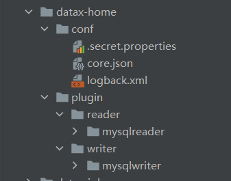
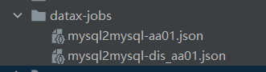
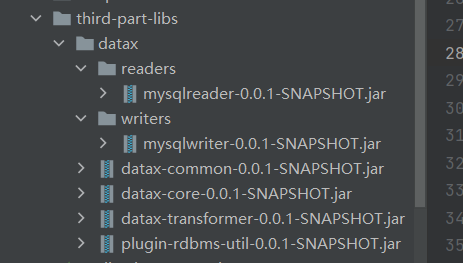
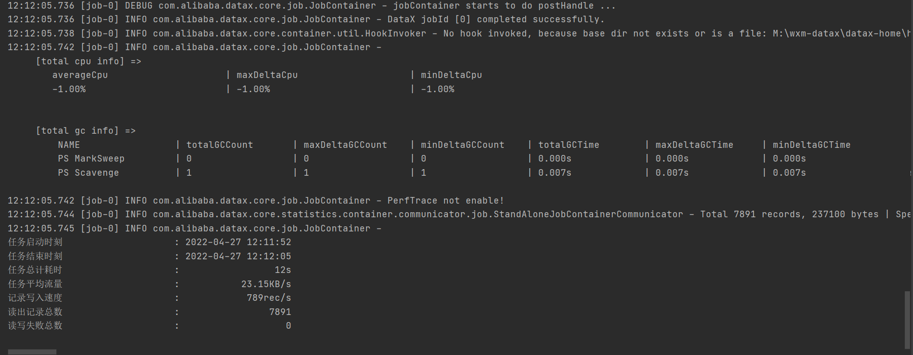

## 一、datax 下载和打包
1. 工具包
   > http://datax-opensource.oss-cn-hangzhou.aliyuncs.com/datax.tar.gz
   > 包含了对应的基本jar,和读写的工具jar和plugin
2. 源码下载编译
> https://github.com/alibaba/DataX
> 
> git clone git@github.com:alibaba/DataX.git
> 自己编译得到基本的jar和工具jar,和plugin

## 二、springboot 集成 datax
> 数据同步以mysql 同步到mysql 为例

### 新建datax-home 
> 目录： M:\wxm-datax\datax-home  调用时需要指定目录
1. 把 datax-core  中config 目录复制进来
2. 新建plugin/reader  和plugin/writer目录
3. 找到需要用到的plugin 放入进来(默认的是mysql5,如果使用mysql8 把对应reader和writer 中的驱动换成mysql8)

   
### 新建同步数据的job文件存放目录datax-jobs  调用时需要指定里面的文件
> 目录： M:\wxm-datax\datax-jobs

> 把同步数据的job文件放入，job文件查看datax官网
> 

### 搭建springboot工程
1. 在resources目录下新建third-part-libs 存放datax的jar

   
2. pom.xml
```xml
<?xml version="1.0" encoding="UTF-8"?>
<project xmlns="http://maven.apache.org/POM/4.0.0" xmlns:xsi="http://www.w3.org/2001/XMLSchema-instance"
         xsi:schemaLocation="http://maven.apache.org/POM/4.0.0 https://maven.apache.org/xsd/maven-4.0.0.xsd">
   <modelVersion>4.0.0</modelVersion>
   <parent>
      <groupId>org.springframework.boot</groupId>
      <artifactId>spring-boot-starter-parent</artifactId>
      <version>2.4.4</version>
      <relativePath/> <!-- lookup parent from repository -->
   </parent>
   <groupId>com.wxm</groupId>
   <artifactId>wxm-datax</artifactId>
   <version>0.0.1-SNAPSHOT</version>
   <name>wxm-datax</name>
   <description>Demo project for Spring Boot</description>
   <properties>
      <project-sourceEncoding>UTF-8</project-sourceEncoding>
      <project.build.sourceEncoding>UTF-8</project.build.sourceEncoding>
      <project.reporting.outputEncoding>UTF-8</project.reporting.outputEncoding>
      <maven.compiler.encoding>UTF-8</maven.compiler.encoding>

      <java.version>1.8</java.version>
      <mysql.version>8.0.22</mysql.version>
      <druid.version>1.1.22</druid.version>
      <commons-cli.version>1.2</commons-cli.version>
      <!-- common -->
      <commons-lang3.version>3.3.2</commons-lang3.version>
      <!-- http -->
      <httpclient.version>4.5</httpclient.version>
      <commons-io.version>2.4</commons-io.version>
      <httpclient.version>4.5.3</httpclient.version>
      <!-- json -->
      <fastjson.version>1.2.28</fastjson.version>
      <commons-lang.version>2.4</commons-lang.version>
   </properties>

   <dependencies>
      <dependency>
         <groupId>org.springframework.boot</groupId>
         <artifactId>spring-boot-starter-web</artifactId>
      </dependency>

      <dependency>
         <groupId>my.com.alibaba.datax</groupId>
         <artifactId>datax-common</artifactId>
         <version>0.0.1-SNAPSHOT</version>
         <scope>system</scope>
         <systemPath>${project.basedir}/src/main/resources/third-part-libs/datax/datax-common-0.0.1-SNAPSHOT.jar</systemPath>
      </dependency>

      <dependency>
         <groupId>my.com.alibaba.datax</groupId>
         <artifactId>datax-core</artifactId>
         <version>0.0.1-SNAPSHOT</version>
         <scope>system</scope>
         <systemPath>${project.basedir}/src/main/resources/third-part-libs/datax/datax-core-0.0.1-SNAPSHOT.jar</systemPath>
      </dependency>

      <dependency>
         <groupId>my.com.alibaba.datax</groupId>
         <artifactId>datax-transformer</artifactId>
         <version>0.0.1-SNAPSHOT</version>
         <scope>system</scope>
         <systemPath>${project.basedir}/src/main/resources/third-part-libs/datax/datax-transformer-0.0.1-SNAPSHOT.jar</systemPath>
      </dependency>

      <dependency>
         <groupId>my.com.alibaba.datax</groupId>
         <artifactId>datax-plugin-rdbms-util</artifactId>
         <version>0.0.1-SNAPSHOT</version>
         <scope>system</scope>
         <systemPath>${project.basedir}/src/main/resources/third-part-libs/datax/plugin-rdbms-util-0.0.1-SNAPSHOT.jar</systemPath>
      </dependency>

      <dependency>
         <groupId>my.com.alibaba.datax</groupId>
         <artifactId>datax-mysqlreader</artifactId>
         <version>0.0.1-SNAPSHOT</version>
         <scope>system</scope>
         <systemPath>${project.basedir}/src/main/resources/third-part-libs/datax/readers/mysqlreader-0.0.1-SNAPSHOT.jar</systemPath>
      </dependency>

      <dependency>
         <groupId>my.com.alibaba.datax</groupId>
         <artifactId>datax-mysqlwriter</artifactId>
         <version>0.0.1-SNAPSHOT</version>
         <scope>system</scope>
         <systemPath>${project.basedir}/src/main/resources/third-part-libs/datax/writers/mysqlwriter-0.0.1-SNAPSHOT.jar</systemPath>
      </dependency>


      <dependency>
         <groupId>mysql</groupId>
         <artifactId>mysql-connector-java</artifactId>
         <version>${mysql.version}</version>
      </dependency>

      <!-- https://mvnrepository.com/artifact/com.alibaba/druid -->
      <dependency>
         <groupId>com.alibaba</groupId>
         <artifactId>druid</artifactId>
         <version>${druid.version}</version>
      </dependency>


      <!-- https://mvnrepository.com/artifact/commons-cli/commons-cli -->
      <dependency>
         <groupId>commons-cli</groupId>
         <artifactId>commons-cli</artifactId>
         <version>${commons-cli.version}</version>
      </dependency>
      <!-- https://mvnrepository.com/artifact/org.apache.httpcomponents/httpclient -->
      <dependency>
         <groupId>org.apache.httpcomponents</groupId>
         <artifactId>httpclient</artifactId>
         <version>${httpclient.version}</version>
      </dependency>


      <!-- https://mvnrepository.com/artifact/org.apache.httpcomponents/httpclient -->
      <dependency>
         <groupId>org.apache.httpcomponents</groupId>
         <artifactId>httpclient</artifactId>
         <version>${httpclient.version}</version>
      </dependency>

      <!-- https://mvnrepository.com/artifact/commons-io/commons-io -->
      <dependency>
         <groupId>commons-io</groupId>
         <artifactId>commons-io</artifactId>
         <version>${commons-io.version}</version>
      </dependency>

      <!-- https://mvnrepository.com/artifact/org.apache.commons/commons-lang3 -->
      <dependency>
         <groupId>org.apache.commons</groupId>
         <artifactId>commons-lang3</artifactId>
         <version>${commons-lang3.version}</version>
      </dependency>

      <!-- https://mvnrepository.com/artifact/commons-lang/commons-lang -->
      <dependency>
         <groupId>commons-lang</groupId>
         <artifactId>commons-lang</artifactId>
         <version>${commons-lang.version}</version>
      </dependency>


      <!-- https://mvnrepository.com/artifact/com.alibaba/fastjson -->
      <dependency>
         <groupId>com.alibaba</groupId>
         <artifactId>fastjson</artifactId>
         <version>${fastjson.version}</version>
      </dependency>


      <dependency>
         <groupId>org.projectlombok</groupId>
         <artifactId>lombok</artifactId>
         <optional>true</optional>
      </dependency>
      <dependency>
         <groupId>org.springframework.boot</groupId>
         <artifactId>spring-boot-starter-test</artifactId>
         <scope>test</scope>
      </dependency>
   </dependencies>
   <repositories>
      <repository>
         <id>central</id>
         <name>Nexus aliyun</name>
         <url>https://maven.aliyun.com/repository/central</url>
         <releases>
            <enabled>true</enabled>
         </releases>
         <snapshots>
            <enabled>true</enabled>
         </snapshots>
      </repository>
   </repositories>

   <pluginRepositories>
      <pluginRepository>
         <id>central</id>
         <name>Nexus aliyun</name>
         <url>https://maven.aliyun.com/repository/central</url>
         <releases>
            <enabled>true</enabled>
         </releases>
         <snapshots>
            <enabled>true</enabled>
         </snapshots>
      </pluginRepository>
   </pluginRepositories>
   <build>
      <plugins>


         <plugin>
            <groupId>org.springframework.boot</groupId>
            <artifactId>spring-boot-maven-plugin</artifactId>
            <configuration>
               <!--打包时包含本地引入的jar-->
               <includeSystemScope>true</includeSystemScope>
               <excludes>
                  <exclude>
                     <groupId>org.projectlombok</groupId>
                     <artifactId>lombok</artifactId>
                  </exclude>
               </excludes>
            </configuration>
         </plugin>
      </plugins>
   </build>

</project>

```
3. 新建同步工具类 DataXUtil
```java
package com.wxm.datax.utils;

import com.alibaba.datax.common.exception.ExceptionTracker;
import com.alibaba.datax.core.Engine;
import lombok.extern.slf4j.Slf4j;
import org.apache.commons.lang3.StringUtils;

import java.io.File;

/**
 * <p></p>
 * <p></p>
 *
 * @author 王森明
 * @date 2022/4/26 12:18
 * @since 1.0.0
 */
@Slf4j
public class DataXUtil {
   public void start(String jsonPath,String dataXHomePath){
      System.setProperty("datax.home",dataXHomePath);
      String[] datxArgs = {"-job", jsonPath,
              "-mode", "standalone",
              "-jobid", "-1"};
      try {
         Engine.entry(datxArgs);
      } catch (Throwable var6) {
         log.error("\n\n经DataX智能分析,该任务最可能的错误原因是:\n" + ExceptionTracker.trace(var6));
      }
   }

}

```

4. 编写同步数据job文件 mysql2mysql-dis_aa01.json 放入datax-jobs 下面
> datax 不能同步表结构，先要在目标库中间对应的表

```json
{
  "job": {
    "setting": {
      "speed": {
        "channel": 3,
        "byte": 1048576
      },
      "errorLimit": {
        "record": 0,
        "percentage": 0.02
      }
    },
    "content": [
      {
        "reader": {
          "name": "mysqlreader",
          "parameter": {
            "username": "disabled",
            "password": "disabled",
            "splitPk": "",
	    "column": ["aaa001","aaa002","aaa005","aaa104","aaa105","prseno","aaa010","aaa011"],
            "connection": [
              {
                "jdbcUrl": [
                  "jdbc:mysql://192.168.179.125:3306/disabled?useSSL=false&serverTimezone=GMT%2B8&allowPublicKeyRetrieval=true&useAffectedRows=true&zeroDateTimeBehavior=convertToNull"
                ],
                "table": ["dis_aa01"]
              }
            ],
	    "where": ""
	    
          }
        },
        "writer": {
          "name": "mysqlwriter",
          "parameter": {
            "username": "root",
            "password": "root123",
            "column": ["aaa001","aaa002","aaa005","aaa104","aaa105","prseno","aaa010","aaa011"],
            "connection": [
              {
                "table": [
                  "dis_aa01"
                ],
                "jdbcUrl": "jdbc:mysql://192.168.179.125:3306/mtms?useSSL=false&serverTimezone=GMT%2B8&allowPublicKeyRetrieval=true&useAffectedRows=true&zeroDateTimeBehavior=convertToNull"
              }
            ],
	    "writeMode": "update",
	     "preSql": []
          }
        }
      }
    ]
  }
}

```

6. 编写测试类 SimpleTest
```java
package com.wxm.datax.test;

import com.wxm.datax.utils.DataXUtil;
import lombok.extern.slf4j.Slf4j;

/**
 * <p></p>
 * <p></p>
 *
 * @author 王森明
 * @date 2022/4/26 11:23
 * @since 1.0.0
 */
@Slf4j
public class SimpleTest {
   public static void main(String [] args){
      String jsonFilePath="M:\\wxm-datax\\datax-jobs\\mysql2mysql-dis_aa01.json";
      String dataXHomePath="M:\\wxm-datax\\datax-home";
      DataXUtil dx = new DataXUtil();
      dx.start(jsonFilePath, dataXHomePath);
   }
}

```

6. 测试结果

   
7. 后记
> 如果把 datax-home  和 datax-jobs 放入源码中，通过classpath 获取路径，本地运行正常，打包后却找不到文件
