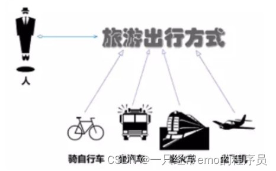
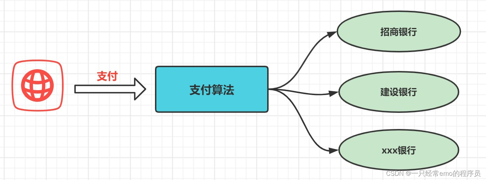
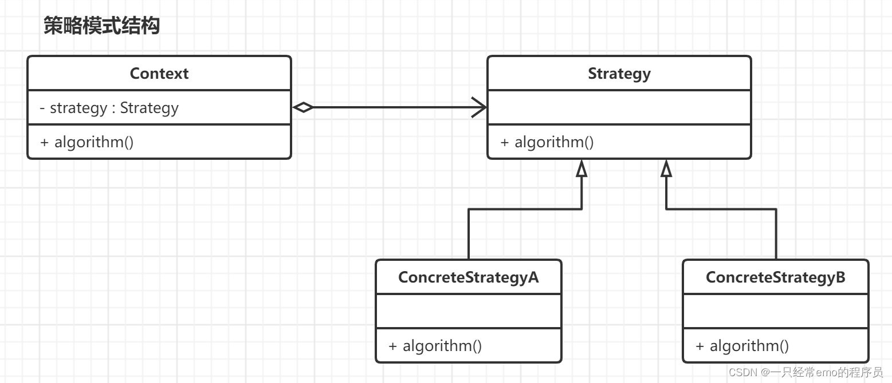

JAVA设计模式之策略模式详解
策略模式
1 策略模式概述
策略模式(strategy pattern)的原始定义是：定义一系列算法，将每一个算法封装起来，并使它们可以相互替换。策略模式让算法可以独立于使用它的客户端而变化。

其实我们在现实生活中常常遇到实现某种目标存在多种策略可供选择的情况，例如，出行旅游可以乘坐飞机、乘坐火车、骑自行车或自己开私家车等。



在软件开发中,经常会遇到这种情况,开发一个功能可以通过多个算法去实现,我们可以将所有的算法集中在一个类中,在这个类中提供多个方法,每个方法对应一个算法, 或者我们也可以将这些算法都封装在一个统一的方法中,使用if…else…等条件判断语句进行选择.但是这两种方式都存在硬编码的问题,后期需要增加算法就需要修改源代码,这会导致代码的维护变得困难.

比如网购，你可以选择工商银行、农业银行、建设银行等等，但是它们提供的算法都是一致的，就是帮你付款。



在软件开发中也会遇到相似的情况，当实现某一个功能存在多种算法或者策略，我们可以根据环境或者条件的不同选择不同的算法或者策略来完成该功能。

2 策略模式原理
在策略模式中可以定义一些独立的类来封装不同的算法,每一个类封装一种具体的算法,在这里每一个封装算法的类都可以被称为一种策略,为了保证这些策略在使用时具有一致性,一般会提供一个抽象的策略类来做算法的声明.而每种算法对应一个具体的策略类.



策略模式的主要角色如下：

抽象策略（Strategy）类：这是一个抽象角色，通常由一个接口或抽象类实现。此角色给出所有的具体策略类所需的接口。
具体策略（Concrete Strategy）类：实现了抽象策略定义的接口，提供具体的算法实现或行为。
环境或上下文（Context）类：是使用算法的角色, 持有一个策略类的引用，最终给客户端调用。
3 策略模式实现
策略模式的本质是通过Context类来作为中心控制单元，对不同的策略进行调度分配。

```java
/**
* 抽象策略类
  **/
  public interface Strategy {

  void algorithm();
  }

public class ConcreteStrategyA implements Strategy {

    @Override
    public void algorithm() {
        System.out.println("执行策略A");
    }
}

public class ConcreteStrategyB implements Strategy {

    @Override
    public void algorithm() {
        System.out.println("执行策略B");
    }
}

/**
* 环境类
  **/
  public class Context {

  //维持一个对抽象策略类的引用
  private Strategy strategy;

  public Context(Strategy strategy) {
  this.strategy = strategy;
  }

  //调用策略类中的算法
  public void algorithm(){
  strategy.algorithm();
  }
  }

public class Client {

    public static void main(String[] args) {


        Strategy strategyA  = new ConcreteStrategyA();
        Context context = new Context(strategyA); //可以在运行时指定类型,通过配置文件+反射机制实现
        context.algorithm();
    }
}
```


4. 策略模式应用实例
面试问题: 如何用设计模式消除代码中的if-else

物流行业中，通常会涉及到EDI报文(XML格式文件)传输和回执接收，每发送一份EDI报文，后续都会收到与之关联的回执（标识该数据在第三方系统中的流转状态）。

这里列举几种回执类型：MT1101、MT2101、MT4101、MT8104，系统在收到不同的回执报文后，会执行对应的业务逻辑处理。我们就业回执处理为演示案例

不使用设计模式
回执类
```java
/**
* 回执信息
  **/
  public class Receipt {

  private String message; //回执信息

  private String type; //回执类型(MT1101、MT2101、MT4101、MT8104)

  public Receipt() {
  }

  public Receipt(String message, String type) {
  this.message = message;
  this.type = type;
  }

  public String getMessage() {
  return message;
  }

  public void setMessage(String message) {
  this.message = message;
  }

  public String getType() {
  return type;
  }

  public void setType(String type) {
  this.type = type;
  }
  }

// 回执生成器
public class ReceiptBuilder {

    public static List<Receipt> genReceiptList(){
        //模拟回执信息
        List<Receipt> receiptList = new ArrayList<>();
        receiptList.add(new Receipt("MT1101回执","MT1011"));
        receiptList.add(new Receipt("MT2101回执","MT2101"));
        receiptList.add(new Receipt("MT4101回执","MT4101"));
        receiptList.add(new Receipt("MT8104回执","MT8104"));

        //......
        return receiptList;
    }

}
// 客户端
public class Client {

    public static void main(String[] args) {

        List<Receipt> receiptList = ReceiptBuilder.genReceiptList();

        //循环判断
        for (Receipt receipt : receiptList) {
            if("MT1011".equals(receipt.getType())){
                System.out.println("接收到MT1011回执!");
                System.out.println("解析回执内容");
                System.out.println("执行业务逻辑A"+"\n");
            }else if("MT2101".equals(receipt.getType())){
                System.out.println("接收到MT2101回执!");
                System.out.println("解析回执内容");
                System.out.println("执行业务逻辑B"+"\n");
            }else if("MT4101".equals(receipt.getType())) {
                System.out.println("接收到MT4101回执!");
                System.out.println("解析回执内容");
                System.out.println("执行业务逻辑C"+"\n");
            }else if("MT8104".equals(receipt.getType())) {
                System.out.println("接收到MT8104回执!");
                System.out.println("解析回执内容");
                System.out.println("执行业务逻辑D");
            }

            //......
        }
    }
}

```


**使用策略模式进行优化**
通过策略模式, 将所有的if-else分支的业务逻辑抽取为各种策略类,让客户端去依赖策略接口,保证具体策略类的改变不影响客户端.

策略接口

```java
/**
* 回执处理策略接口
  **/
  public interface ReceiptHandleStrategy {

  void handleReceipt(Receipt receipt);
  }

//具体策略类
public class Mt1011ReceiptHandleStrategy implements ReceiptHandleStrategy {

    @Override
    public void handleReceipt(Receipt receipt) {
        System.out.println("解析报文MT1011: " + receipt.getMessage());
    }
}

public class Mt2101ReceiptHandleStrategy implements ReceiptHandleStrategy {

    @Override
    public void handleReceipt(Receipt receipt) {
        System.out.println("解析报文MT2101: " + receipt.getMessage());
    }
}

 

//策略上下文类(策略接口的持有者)
/**
* 上下文类,持有策略接口
  **/
  public class ReceiptStrategyContext {

  private ReceiptHandleStrategy receiptHandleStrategy;

  public void setReceiptHandleStrategy(ReceiptHandleStrategy receiptHandleStrategy) {
  this.receiptHandleStrategy = receiptHandleStrategy;
  }

  //调用策略类中的方法
  public void handleReceipt(Receipt receipt){
  if(receipt != null){
  receiptHandleStrategy.handleReceipt(receipt);
  }
  }
  }

//策略工厂
public class ReceiptHandleStrategyFactory {

    public ReceiptHandleStrategyFactory() {
    }

    //使用Map集合存储策略信息,彻底消除if...else
    private static Map<String,ReceiptHandleStrategy> strategyMap;

    //初始化具体策略,保存到map集合
    public static void init(){
        strategyMap = new HashMap<>();
        strategyMap.put("MT1011",new Mt1011ReceiptHandleStrategy());
        strategyMap.put("MT2101",new Mt2101ReceiptHandleStrategy());
    }

    //根据回执类型获取对应策略类对象
    public static ReceiptHandleStrategy getReceiptHandleStrategy(String receiptType){
        return strategyMap.get(receiptType);
    }
}

//客户端
public class Client {

    public static void main(String[] args) {

        //模拟回执
        List<Receipt> receiptList = ReceiptBuilder.genReceiptList();


        //策略上下文
        ReceiptStrategyContext context = new ReceiptStrategyContext();

        //策略模式将策略的 定义、创建、使用这三部分进行了解耦
        for (Receipt receipt : receiptList) {
            //获取置策略
            ReceiptHandleStrategyFactory.init();
            ReceiptHandleStrategy strategy = ReceiptHandleStrategyFactory.getReceiptHandleStrategy(receipt.getType());
            //设置策略
            context.setReceiptHandleStrategy(strategy);
            //执行策略
            context.handleReceipt(receipt);
        }
    }
}


```

经过上面的改造，我们已经消除了if-else的结构，每当新来了一种回执，只需要添加新的回执处理策略，并修改ReceiptHandleStrategyFactory中的Map集合。如果要使得程序符合开闭原则，则需要调整ReceiptHandleStrategyFactory中处理策略的获取方式，通过反射的方式，获取指定包下的所有IReceiptHandleStrategy实现类，然后放到字典Map中去.

5 策略模式总结
策略模式优点：
策略类之间可以自由切换

由于策略类都实现同一个接口，所以使它们之间可以自由切换。

易于扩展

增加一个新的策略只需要添加一个具体的策略类即可，基本不需要改变原有的代码，符合“开闭原则“

避免使用多重条件选择语句（if else），充分体现面向对象设计思想。

策略模式缺点：
客户端必须知道所有的策略类，并自行决定使用哪一个策略类。
策略模式将造成产生很多策略类，可以通过使用享元模式在一定程度上减少对象的数量。
策略模式使用场景
一个系统需要动态地在几种算法中选择一种时，可将每个算法封装到策略类中。

策略模式最大的作用在于分离使用算法的逻辑和算法自身实现的逻辑，这样就意味着当我们想要优化算法自身的实现逻辑时就变得非常便捷，一方面可以采用最新的算法实现逻辑，另一方面可以直接弃用旧算法而采用新算法。使用策略模式能够很方便地进行替换。

一个类定义了多种行为，并且这些行为在这个类的操作中以多个条件语句的形式出现，可将每个条件分支移入它们各自的策略类中以代替这些条件语句。

在实际开发中，有许多算法可以实现某一功能，如查找、排序等，通过 if-else 等条件判断语句来进行选择非常方便。但是这就会带来一个问题：当在这个算法类中封装了大量查找算法时，该类的代码就会变得非常复杂，维护也会突然就变得非常困难。虽然策略模式看上去比较笨重，但实际上在每一次新增策略时都通过新增类来进行隔离，短期虽然不如直接写 if-else 来得效率高，但长期来看，维护单一的简单类耗费的时间其实远远低于维护一个超大的复杂类。

系统要求使用算法的客户不应该知道其操作的数据时，可使用策略模式来隐藏与算法相关的数据结构。

如果我们不希望客户知道复杂的、与算法相关的数据结构,在具体策略类中封装算法与相关数据结构,可以提高算法的保密性与安全性.

设计原则和思想其实比设计模式更加的普适和重要,掌握了代码的设计原则和思想,我们自然而然的就可以使用到设计模式,还有可能自己创建出一种新的设计模式.

