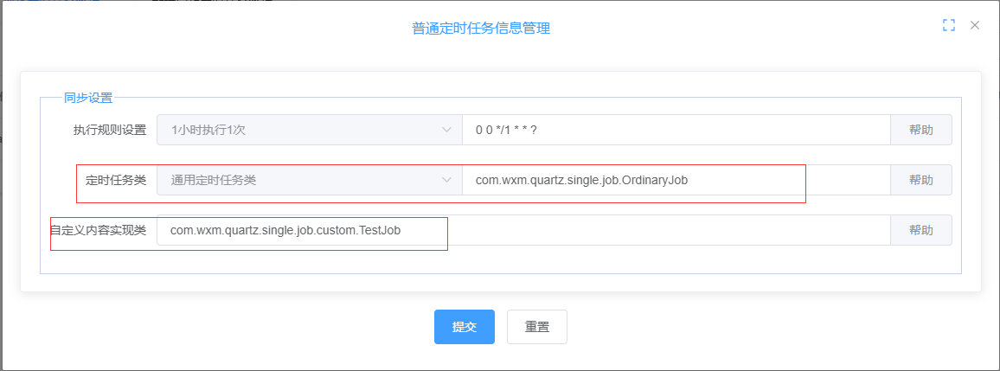
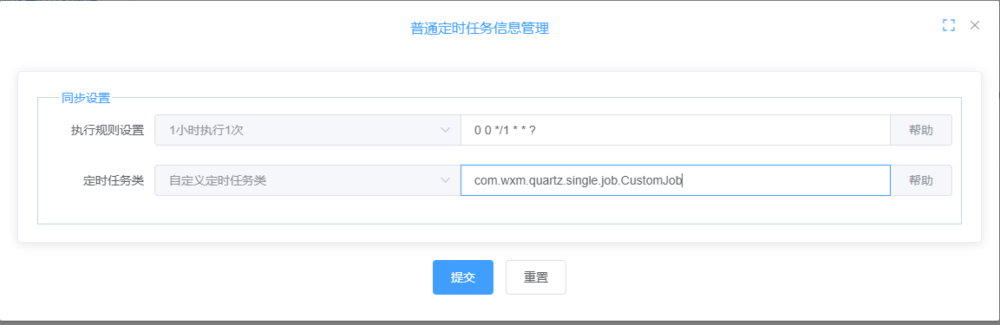

## 定时任务
### 第一种：定时任务类，采用“通用定时任务类”（不推荐）
#### 1. 编写自定义的实现
> 继承抽象类 *com.wxm.quartz.single.job.OrdinaryAbstract* 实现 *execute*方法

例如：
```java
package com.wxm.quartz.single.job.custom;

import com.wxm.quartz.single.job.OrdinaryAbstract;
import lombok.extern.slf4j.Slf4j;
import org.springframework.beans.factory.annotation.Value;
import org.springframework.stereotype.Component;

/**
 * <p></p>
 * <p></p>
 *
 * @author 王森明
 * @date 2022/7/11 14:45
 * @since 1.0.0
 */
@Slf4j
@Component
public class TestJob extends OrdinaryAbstract {
    @Value("${quartz.my.ordinary.message}")
    private String quartzTestMsg;
    @Override
    public void execute() {
        log.info("************************************************************************");
        log.info("************************************************************************");
        log.info("********************custom 定时任务实现 开始******************************");
        log.info("************************************************************************");

        log.info("执行结果：{}",this.quartzTestMsg);

        log.info("************************************************************************");
        log.info("************************************************************************");
        log.info("********************custom 定时任务实现 结束******************************");
        log.info("************************************************************************");
        log.info("************************************************************************");
    }
}
```

#### 2. 普通定时任务管理模块中配置



### 第二种、定时任务类，自己实现Job(推荐)
#### 1. 编写自定义的job实现
```java
package com.wxm.quartz.single.job;

import lombok.extern.slf4j.Slf4j;
import org.quartz.Job;
import org.quartz.JobExecutionContext;
import org.quartz.JobExecutionException;
import org.springframework.beans.factory.annotation.Autowired;
import org.springframework.context.ApplicationContext;
import org.springframework.stereotype.Component;
import org.springframework.util.StringUtils;
import org.springframework.web.context.support.SpringBeanAutowiringSupport;

/**
 * <p></p>
 * <p></p>
 *
 * @author 王森明
 * @date 2022/7/11 14:03
 * @since 1.0.0
 */
@Slf4j
@Component
public class CustomJob implements Job {
    @Override
    public void execute(JobExecutionContext context) throws JobExecutionException {

        log.info(">>>>>>>>>>>>>>普通定时任务开始>>>>>>>>>>>>>>>>>>>>>>>");
        // 内容
        log.info(">>>>>>>>>>>>>>普通定时任务结束>>>>>>>>>>>>>>>>>>>>>>>");
    }
}

```

#### 2. 普通定时任务管理模块中配置
